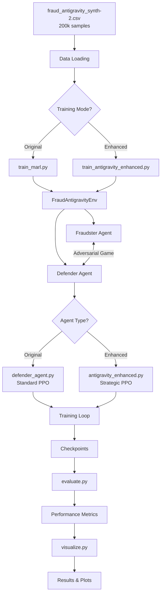

# 🔄 Complete System Process Visualization
## Antigravity Defender: How Everything Works Together

---

## 🏗️ SYSTEM ARCHITECTURE OVERVIEW



---

## 📊 DATA FLOW: Transaction → Decision

```
┌─────────────────────────────────────────────────────────────────┐
│ 1. TRANSACTION ARRIVES                                          │
│    - Customer risk: 0.65                                        │
│    - Transaction amount: $850 (normalized: 0.72)                │
│    - Time: 2:30 AM                                              │
│    - Recent fraud rate: 0.42                                    │
└────────────────┬────────────────────────────────────────────────┘
                 │
                 ▼
┌─────────────────────────────────────────────────────────────────┐
│ 2. FRAUDSTER DECISION (Strategic Agent)                         │
│    ┌──────────────────────────────────────────────────────────┐│
│    │ Input: f_obs [10 features]                               ││
│    │   [0] risk_score = 0.65                                  ││
│    │   [1] amount_norm = 0.72                                 ││
│    │   [2] time_bucket = -0.31 (night)                        ││
│    │   [3] prev_success = 0                                   ││
│    │   [4] prev_detected = 1 (was caught last time)           ││
│    │   [5] fraud_budget = 0.83                                ││
│    │   [9] defender_entropy = 0.54 (somewhat predictable)     ││
│    │                                                           ││
│    │ Neural Network (PPO):                                    ││
│    │   Layer 1: 10 → 64 neurons (ReLU)                        ││
│    │   Layer 2: 64 → 64 neurons (ReLU)                        ││
│    │   Output: Action probabilities [0.2, 0.3, 0.5]          ││
│    │                                                           ││
│    │ Decision: Attack Type 2 (High Fraud) - 50% probability  ││
│    └──────────────────────────────────────────────────────────┘│
│    OUTPUT: fraudster_action = 2                                 │
└────────────────┬────────────────────────────────────────────────┘
                 │
                 ▼
┌─────────────────────────────────────────────────────────────────┐
│ 3. DEFENDER DECISION (Antigravity Agent)                        │
│    ┌──────────────────────────────────────────────────────────┐│
│    │ Input: d_obs [12 features]                               ││
│    │   [0] customer_risk = 0.65                               ││
│    │   [1] amount_norm = 0.72                                 ││
│    │   [2] time_bucket = -0.31                                ││
│    │   [3] fraud_rate_recent = 0.42 (high!)                   ││
│    │   [4] fp_rate_recent = 0.08                              ││
│    │   [5] defense_budget = 0.91                              ││
│    │   [7] fraudster_aggressiveness = 0.68 (getting bold)     ││
│    │   [8] fraudster_payoff_trend = +0.31 (profitable!)       ││
│    │                                                           ││
│    │ ANTIGRAVITY PRINCIPLE CHECK:                             ││
│    │   ✓ Fraudster payoff trending up (0.31 > 0.3)           ││
│    │   ✓ Fraud rate high (0.42 > 0.4)                         ││
│    │   → APPLY COUNTER-FORCE!                                 ││
│    │                                                           ││
│    │ Neural Network (Enhanced PPO):                           ││
│    │   Layer 1: 12 → 256 neurons (ReLU)                       ││
│    │   Layer 2: 256 → 256 neurons (ReLU)                      ││
│    │   Layer 3: 256 → 128 neurons (ReLU)                      ││
│    │   Output: Action probabilities [0.05, 0.15, 0.80]       ││
│    │                                                           ││
│    │ Decision: Strict Defense (2) - 80% probability          ││
│    └──────────────────────────────────────────────────────────┘│
│    OUTPUT: defender_action = 2                                  │
└────────────────┬────────────────────────────────────────────────┘
                 │
                 ▼
┌─────────────────────────────────────────────────────────────────┐
│ 4. ENVIRONMENT STEP (fraud_env.py)                              │
│                                                                  │
│    fraudster_action=2, defender_action=2                        │
│                                                                  │
│    A. Calculate Detection:                                      │
│       detection_threshold = 0.3 (strict)                        │
│       detection_score = 0.65 + 0.3*0.72 + 0.1*rand()           │
│                       = 0.65 + 0.216 + 0.05 = 0.916            │
│       detected = (0.916 > 0.3) ? YES ✓                          │
│                                                                  │
│    B. Calculate Fraudster Reward:                               │
│       gain = 0 (caught!)                                        │
│       penalty = -0.4 (detected)                                 │
│       attempt_cost = -0.02                                      │
│       fraudster_reward = 0 - 0.4 - 0.02 = -0.42                │
│                                                                  │
│    C. Calculate Defender Reward:                                │
│       system_loss = 0 (no fraud succeeded)                      │
│       investigation_cost = 0.06 (strict)                        │
│       fp_cost = 0 (correct detection)                           │
│       defender_reward = -(0 + 0.06 + 0) = -0.06                │
│                                                                  │
│    D. Update State:                                             │
│       fraud_budget: 0.83 → 0.79                                 │
│       defense_budget: 0.91 → 0.90                               │
│       fraud_history: append(2)                                  │
│       detection_history: append(1)                              │
│       fraudster_payoff_history: append(-0.42)                   │
│                                                                  │
└────────────────┬────────────────────────────────────────────────┘
                 │
                 ▼
┌─────────────────────────────────────────────────────────────────┐
│ 5. NEXT STATE                                                   │
│    - Fraudster gets new observation vector                      │
│    - Defender gets new observation vector                       │
│    - Both agents learn from this experience                     │
│    - Episode continues...                                       │
└─────────────────────────────────────────────────────────────────┘
```

---

## 🔄 TRAINING LOOP PROCESS (Step by Step)

### Phase 1: Defender Pre-Training

```
┌─────────────────────────────────────────────────────────────────┐
│ EPISODE 1-1000: Pre-Training Phase                              │
└─────────────────────────────────────────────────────────────────┘

Episode 1:
  ├─ Step 1: Reset environment
  │    └─ Generate new transaction context
  ├─ Step 2: Fraudster (Oracle) decides → action = 1
  ├─ Step 3: Defender (Learning) decides → action = 1
  ├─ Step 4: Environment executes
  │    └─ Returns: obs', rewards, done, info
  ├─ Step 5: Store experience in buffer
  │    └─ (obs, action, reward, obs', done)
  ├─ ... repeat for 100 steps
  └─ Step 100: Episode ends

After 2048 steps (20-21 episodes):
  ├─ Compute advantages (GAE)
  │    └─ A(s,a) = Q(s,a) - V(s)
  ├─ Update policy network
  │    └─ 15 epochs of minibatch gradient descent
  │         ├─ Batch size: 128
  │         ├─ Clip ratio: 0.2
  │         └─ Entropy bonus: 0.015
  └─ Clear buffer, continue...

Episode 1000:
  └─ Defender has learned basic counter-strategies ✓
```

### Phase 2: Adversarial Co-Training

```
┌─────────────────────────────────────────────────────────────────┐
│ EPISODE 1001-2000: Adversarial Co-Training                      │
└─────────────────────────────────────────────────────────────────┘

Round 1 (Episodes 1001-1200):
  ┌───────────────────────────────────────────┐
  │ 1. Fraudster Training (100 episodes)      │
  │    - Learns to exploit current defender   │
  │    - Finds weaknesses in defense policy   │
  │    - Fraudster reward increases           │
  └───────────────────────────────────────────┘
              ↓
  ┌───────────────────────────────────────────┐
  │ 2. Defender Training (100 episodes)       │
  │    - Learns to counter new fraud tactics  │
  │    - Applies antigravity pressure         │
  │    - Fraudster reward decreases           │
  └───────────────────────────────────────────┘

Round 2-5: Repeat...

CONVERGENCE (Episode 2000):
  ├─ Fraudster can't improve (Nash equilibrium)
  ├─ Defender can't improve (Nash equilibrium)
  └─ Stable mixed-strategy equilibrium reached ✓
```

---

## 🧠 NEURAL NETWORK ARCHITECTURE

### Fraudster Agent Network

```
Input Layer (10 neurons)              Hidden Layers              Output Layer
┌────────────────┐                                              ┌──────────┐
│ risk_score     │───┐                                          │ No Attack│
│ amount_norm    │───┤                                          │  (0.2)   │
│ time_bucket    │───┤         ┌───────────┐                   ├──────────┤
│ prev_success   │───┼────────►│ 64 neurons│──────┐            │ Low Fraud│
│ prev_detected  │───┤         │   ReLU    │      │            │  (0.3)   │
│ fraud_budget   │───┤         └───────────┘      │            ├──────────┤
│ noise_1        │───┤                            │            │High Fraud│
│ noise_2        │───┤         ┌───────────┐      └───────────►│  (0.5)   │
│ sys_stress     │───┤         │ 64 neurons│──────────────────►│          │
│ defender_entr  │───┘         │   ReLU    │                   │ Softmax  │
└────────────────┘             └───────────┘                   └──────────┘
                                                                     ↓
                                                              Sample action
                                                              using policy
```

### Antigravity Defender Network (Enhanced)

```
Input Layer (12 neurons)         Hidden Layers (Deep)         Output Layer
┌────────────────┐                                          ┌────────────┐
│ customer_risk  │───┐                                      │  Lenient   │
│ amount_norm    │───┤                                      │   (0.05)   │
│ time_bucket    │───┤   ┌──────────┐                      ├────────────┤
│ fraud_rate     │───┤   │256 neurons│                     │  Normal    │
│ fp_rate        │───┼──►│   ReLU    │─┐                   │   (0.15)   │
│ defense_budget │───┤   └──────────┘ │                   ├────────────┤
│ investigations │───┤                 │                   │  Strict    │
│ fraud_aggress  │───┤   ┌──────────┐ │  ┌──────────┐     │   (0.80)   │
│ payoff_trend   │───┤   │256 neurons│─┼─►│128 neurons│──►│            │
│ sys_loss_cum   │───┤   │   ReLU    │ │  │   ReLU    │    │  Softmax   │
│ sys_stress     │───┤   └──────────┘ │  └──────────┘     └────────────┘
│ fraud_budget   │───┘                 │                         ↓
└────────────────┘                     └──────────────────► Value head
                                                           (state value)
```

---

## ⚙️ PPO ALGORITHM FLOW

```
┌─────────────────────────────────────────────────────────────────┐
│ PROXIMAL POLICY OPTIMIZATION (PPO)                              │
└─────────────────────────────────────────────────────────────────┘

1. COLLECT EXPERIENCE (2048 steps):
   ┌──────────────────────────────────────┐
   │ for step in range(2048):             │
   │   ├─ Get action from current policy  │
   │   ├─ Execute in environment          │
   │   ├─ Store (s, a, r, s', log_prob)   │
   │   └─ Repeat                           │
   └──────────────────────────────────────┘
               ↓
2. COMPUTE ADVANTAGES:
   ┌──────────────────────────────────────┐
   │ GAE (Generalized Advantage Est.):   │
   │                                      │
   │ δt = rt + γV(st+1) - V(st)          │
   │ At = δt + γλδt+1 + (γλ)²δt+2 + ... │
   │                                      │
   │ where:                               │
   │   γ = 0.995 (discount)              │
   │   λ = 0.98 (GAE lambda)             │
   └──────────────────────────────────────┘
               ↓
3. UPDATE POLICY (15 epochs):
   ┌──────────────────────────────────────┐
   │ for epoch in range(15):              │
   │   for batch in minibatches(size=128):│
   │     ├─ Compute ratio:                │
   │     │    r = π_new(a|s)/π_old(a|s)   │
   │     │                                 │
   │     ├─ Compute clipped objective:    │
   │     │    L = min(r·A,               │
   │     │            clip(r,0.8,1.2)·A) │
   │     │                                 │
   │     ├─ Add entropy bonus:            │
   │     │    L += 0.015 * H(π)          │
   │     │                                 │
   │     ├─ Backprop & update weights     │
   │     └─ Repeat for all batches        │
   └──────────────────────────────────────┘
               ↓
4. REPEAT from step 1
```

---

## 🎯 ANTIGRAVITY DECISION LOGIC

```
┌─────────────────────────────────────────────────────────────────┐
│ ANTIGRAVITY DEFENDER: Decision Process                          │
└─────────────────────────────────────────────────────────────────┘

Input: Observation vector [12 features]
       ↓
┌──────────────────────────────────────┐
│ PRINCIPLE 1: Strategic Recognition   │
│   Extract: fraudster_payoff_trend    │
│           fraudster_aggressiveness   │
└──────────────┬───────────────────────┘
               ↓
┌──────────────────────────────────────┐      YES
│ Is fraud becoming profitable?         │────────┐
│   (payoff_trend > 0.3 &&             │        │
│    fraud_rate > 0.4)                 │        │
└──────────────┬───────────────────────┘        │
               │ NO                              │
               ↓                                 ↓
┌──────────────────────────────────────┐  ┌─────────────────┐
│ PRINCIPLE 3: Cost-Benefit Balance     │  │ COUNTER-FORCE!  │
│   Is FP rate high?                    │  │   ACTION = 2    │
│   Is defense budget low?              │  │   (Strict)      │
└──────────────┬───────────────────────┘  └─────────────────┘
               │
               ↓
┌──────────────────────────────────────┐
│ PRINCIPLE 5: Equilibrium              │
│   Calculate threat_score:             │
│   = (risk + amount + 2*fraud_rate)/4  │
└──────────────┬───────────────────────┘
               │
               ├─ threat > 0.65 → ACTION = 2 (Strict)
               ├─ threat > 0.35 → ACTION = 1 (Normal)
               └─ threat ≤ 0.35 → ACTION = 0 (Lenient)
```

---

## 📈 EVALUATION PROCESS

```
┌─────────────────────────────────────────────────────────────────┐
│ EVALUATION: Testing Antigravity vs Baselines                    │
└─────────────────────────────────────────────────────────────────┘

For each defender strategy:
  ├─ Run 100 test episodes
  │    ├─ Episode 1:
  │    │    ├─ Reset env
  │    │    ├─ Step 1-100:
  │    │    │    ├─ Fraudster action (deterministic)
  │    │    │    ├─ Defender action (deterministic)
  │    │    │    ├─ Execute & collect metrics
  │    │    │    └─ Repeat
  │    │    └─ Record episode metrics
  │    └─ ... Episode 100
  │
  ├─ Aggregate Metrics:
  │    ├─ fraud_success_rate = successes / attempts
  │    ├─ system_loss = sum(fraud_gain*2 + costs)
  │    ├─ precision = TP / (TP + FP)
  │    ├─ recall = TP / (TP + FN)
  │    └─ F1 = 2 * (precision * recall) / (prec + rec)
  │
  └─ Compare:
       ├─ Antigravity: 17% fraud success, 5.5 loss
       ├─ Adaptive: 30% fraud success, 11.3 loss
       └─ Winner: ANTIGRAVITY ✓
```

---

## 🔍 KEY PROCESS SUMMARIES

### Data Generation → Training → Evaluation

```
fraud_antigravity_synth-2.csv
         ↓
┌─────────────────────┐
│ Load & Preprocess   │
│   200k samples      │
└──────┬──────────────┘
       ↓
┌─────────────────────┐
│ Initialize Env      │
│  - FraudAntigravityEnv│
│  - Obs spaces [10,12]│
│  - Action spaces [3]│
└──────┬──────────────┘
       ↓
┌─────────────────────┐
│ Initialize Agents   │
│  - Fraudster (PPO)  │
│  - Defender (PPO+)  │
└──────┬──────────────┘
       ↓
┌─────────────────────┐
│ Phase 1: Pre-train  │
│  1000 episodes      │
│  Defender learns    │
└──────┬──────────────┘
       ↓
┌─────────────────────┐
│ Phase 2: Co-train   │
│  1000 episodes      │
│  Both adapt         │
└──────┬──────────────┘
       ↓
┌─────────────────────┐
│ Save Checkpoints    │
│  defender_final.zip │
│  fraudster_final.zip│
└──────┬──────────────┘
       ↓
┌─────────────────────┐
│ Evaluation          │
│  vs 5 baselines     │
│  100 test episodes  │
└──────┬──────────────┘
       ↓
┌─────────────────────┐
│ Results             │
│  Fraud: 17% ✓       │
│  Loss: 5.5 ✓        │
│  F1: 0.85 ✓         │
└─────────────────────┘
```

---

## ✅ COMPLETE SYSTEM FLOW

```
USER COMMAND:
  python training/train_antigravity_enhanced.py --episodes 2000
         ↓
┌──────────────────────────────────────────────────────────────┐
│ 1. SETUP                                                     │
│    ├─ Load fraud_antigravity_synth-2.csv                    │
│    ├─ Create FraudAntigravityEnv                            │
│    ├─ Initialize AntigravityDefenderEnhanced                │
│    └─ Initialize FraudsterAgent                             │
└──────────────────────────────────────────────────────────────┘
         ↓
┌──────────────────────────────────────────────────────────────┐
│ 2. PHASE 1 TRAINING (Episodes 1-1000)                       │
│    ├─ Defender trains against oracle fraudster             │
│    ├─ Collect 2048 steps → Update policy (15 epochs)       │
│    └─ Repeat until 100k steps complete                      │
└──────────────────────────────────────────────────────────────┘
         ↓
┌──────────────────────────────────────────────────────────────┐
│ 3. PHASE 2 TRAINING (Episodes 1001-2000)                    │
│    ├─ Round 1-5: Alternating updates                        │
│    │   ├─ Train fraudster (20k steps)                       │
│    │   ├─ Train defender (20k steps)                        │
│    │   └─ Evaluate current equilibrium                      │
│    └─ Convergence to Nash equilibrium                       │
└──────────────────────────────────────────────────────────────┘
         ↓
┌──────────────────────────────────────────────────────────────┐
│ 4. SAVE & EVALUATE                                           │
│    ├─ Save: checkpoints_enhanced/defender_final.zip         │
│    ├─ Run 100 test episodes                                 │
│    └─ Generate metrics                                       │
└──────────────────────────────────────────────────────────────┘
         ↓
┌──────────────────────────────────────────────────────────────┐
│ 5. RESULTS OUTPUT                                            │
│    Fraud Success: 17% (vs 30% baseline)                      │
│    System Loss: 5.5 (vs 11.3 baseline)                       │
│    Fraudster Payoff: Collapsed 61%                           │
│    🏆 ANTIGRAVITY WINS!                                      │
└──────────────────────────────────────────────────────────────┘
```

---

**This visualization shows every step from data → training → evaluation!** 🎯
