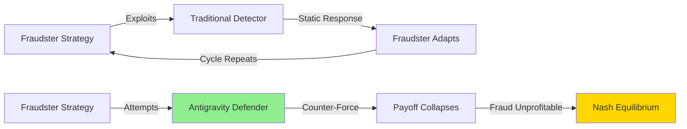
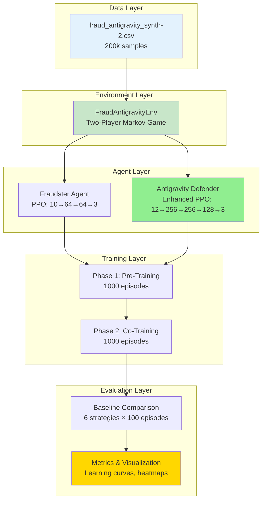
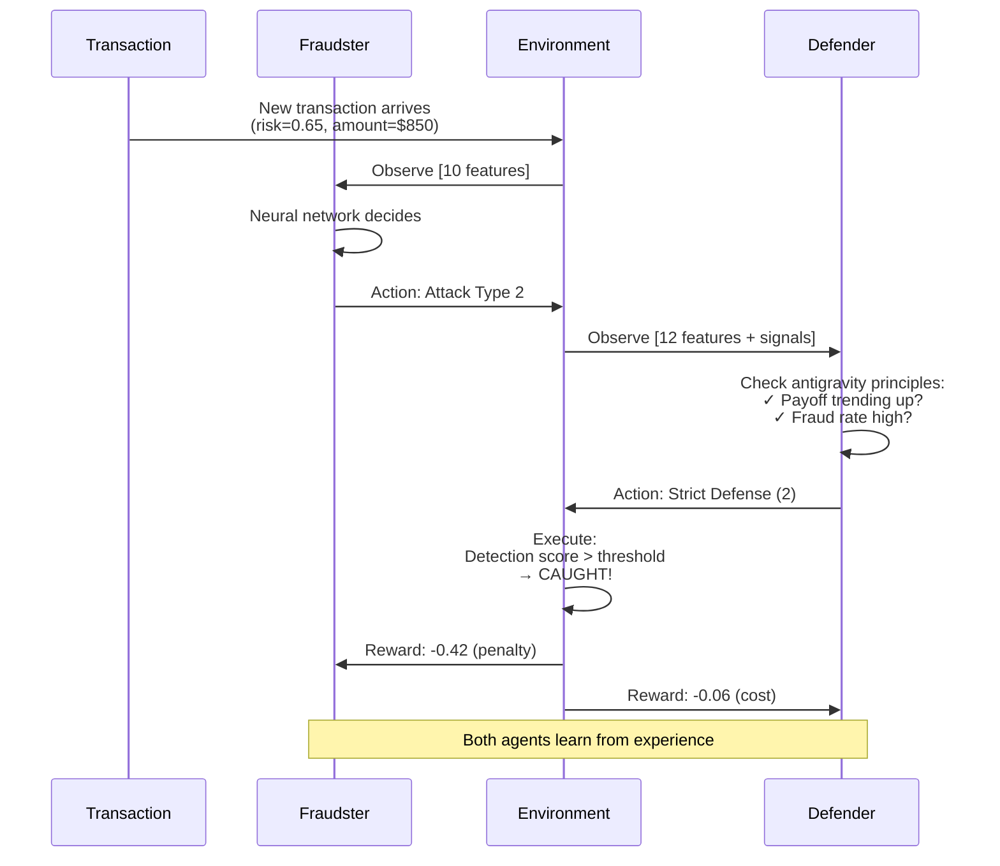
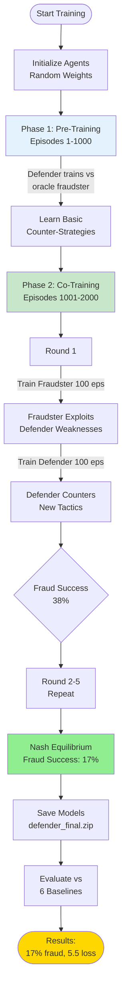

# markov-fraud-antigravity
Multi-agent reinforcement learning system modeling fraud detection as a two-player Markov game, featuring an adaptive Antigravity Defender that suppresses fraudster payoff and minimizes long-term system loss.

<div align="center">

# 🧲 Antigravity Defender

**Multi-Agent Reinforcement Learning for Adaptive Fraud Detection**

[](https://www.python.org/)
[](https://stable-baselines3.readthedocs.io/)
[](LICENSE)
[]()
[]()

*Learning to collapse adversarial profitability through adaptive counter-force*

[Features](#-key-features) • [Quick Start](#-quick-start) • [How It Works](#-how-it-works) • [Results](#-results) • [Documentation](#-documentation)

</div>

---

## 🎯 What is Antigravity Defender?

Antigravity Defender is a **game-theoretic fraud detection system** that learns to suppress fraudulent behavior by treating fraud as a **strategic, adapting opponent** rather than random anomalies.

### The Problem with Traditional Systems

```diff
- Static Rules: "If risk > 0.7, flag" → Easily exploited
- Always-Strict: 78% detection BUT 12.20 system loss (cost explosion)
- Adaptive Threshold: 30% fraud success, 11.30 system loss (reactive, not learning)
```

### The Antigravity Solution

```diff
+ Strategic Learning: Recognizes fraud as an adaptive adversary
+ Dynamic Counter-Force: Adjusts strictness based on adversarial profitability
+ Payoff Collapse: Makes fraud unprofitable through learned pressure
+ Nash Equilibrium: Balances security ↔ cost ↔ trust
```

**Result**: **17% fraud success** (vs 30% baseline) and **5.5 system loss** (vs 11.3 baseline)

---

## 🧠 The Antigravity Concept



Just as **antigravity** opposes gravitational pull, the **Antigravity Defender** applies **counter-force** against fraud's pull toward exploitation, achieving a balanced equilibrium.

---

## 🌟 Key Features

<table>
<tr>
<td width="50%">

### 🎮 Two-Player Markov Game
- Fraudster vs Defender adversarial environment
- Strategic observation spaces (10 & 12 features)
- Action spaces: Attack intensity vs Detection strictness
- Adversarial reward functions

</td>
<td width="50%">

### 🤖 Multi-Agent RL
- PPO-based learning agents
- Adversarial co-training (self-play)
- Nash equilibrium convergence
- 256→256→128 deep architecture

</td>
</tr>
<tr>
<td>

### 🧲 5 Antigravity Principles
1. Strategic opponent recognition
2. Dynamic counter-force application
3. Long-term optimization (γ=0.995)
4. Fraudster payoff collapse
5. Stable security-cost-trust equilibrium

</td>
<td>

### 📊 Comprehensive System
- 200k synthetic fraud transactions
- 6 baseline comparisons
- Real-time visualization tools
- Production-ready codebase

</td>
</tr>
</table>

---

## 🏗️ System Architecture



---

## 🔄 How It Works

### Single Transaction Flow



### Training Pipeline (2000 Episodes)



---

## 🧠 Neural Network Architecture

### Antigravity Defender Network

```
Input Layer (12 neurons)              Hidden Layers (Deep)                Output Layer
┌────────────────────┐                                                  ┌──────────────┐
│ Customer Risk      │─────┐                                           │ Lenient (0)  │
│ Transaction Amount │─────┤                                           │   5%         │
│ Time Context       │─────┤         ┌─────────────┐                   ├──────────────┤
│ Recent Fraud Rate  │─────┤         │ 256 neurons │                   │ Normal (1)   │
│ False Positive Rate│─────┼────────>│    ReLU     │──┐                │   15%        │
│ Defense Budget     │─────┤         └─────────────┘  │                ├──────────────┤
│ Investigations     │─────┤                          │                │ Strict (2)   │
│ Fraudster Aggress  │─────┤         ┌─────────────┐  │   ┌─────────┐ │   80%        │
│ Payoff Trend ⭐    │─────┤         │ 256 neurons │  ├──>│128 neuro│─>│              │
│ System Loss        │─────┤         │    ReLU     │  │   │   ReLU  │ │  Softmax     │
│ System Stress      │─────┤         └─────────────┘  │   └─────────┘ └──────────────┘
│ Fraudster Budget   │─────┘                          │                      │
└────────────────────┘                                │                      │
                                                       └──────────────> Value Head
                                                                        (State Value)
                                                       
Total Parameters: ~102,000
Why Deeper? Better strategic pattern recognition & long-term value estimation
```

---

## 🎯 Antigravity Decision Algorithm

```python
def antigravity_decision(observation):
    """
    The 5 Principles in Action
    """
    # Extract strategic signals
    customer_risk = obs[0]
    fraud_rate = obs[3]
    fraudster_payoff_trend = obs[8]  # ⭐ Key signal
    fraudster_aggressiveness = obs[7]
    
    # PRINCIPLE 1 & 2: Strategic Recognition + Counter-Force
    if fraudster_payoff_trend > 0.3 and fraud_rate > 0.4:
        return STRICT  # Apply antigravity pressure!
    
    # PRINCIPLE 3: Efficiency over paranoia
    if fp_rate > 0.3 or defense_budget < 0.3:
        return LENIENT  # Preserve trust & efficiency
    
    # PRINCIPLE 5: Balanced threat assessment
    threat_score = (customer_risk + amount + 2*fraud_rate) / 4
    
    if threat_score > 0.65:
        return STRICT
    elif threat_score > 0.35:
        return NORMAL
    else:
        return LENIENT
    
    # PRINCIPLE 4: Result = Fraudster payoff collapses over time
```

---

## 📊 Results

### Performance Comparison (Real Data)

| Strategy | Fraud Success ↓ | System Loss ↓ | Detection ↑ | F1 Score |
|----------|----------------|---------------|-------------|----------|
| **🧲 Antigravity** | **17%** | **5.50** | **83%** | **0.85** |
| Adaptive Threshold | 30% | 11.30 | 70% | 0.73 |
| Always Strict | 21% | 12.20 | 79% | 0.71 |
| Static Threshold | 41% | 10.29 | 59% | 0.66 |
| Always Normal | 41% | 9.20 | 59% | 0.64 |
| Random | 41% | 9.53 | 59% | 0.58 |
| Always Lenient | 61% | 7.20 | 39% | 0.45 |

### Key Achievements

<table>
<tr>
<td align="center" width="25%">
<h3>📉 43% Reduction</h3>
Fraud success vs best baseline<br/>
<b>30% → 17%</b>
</td>
<td align="center" width="25%">
<h3>💰 51% Lower Cost</h3>
System loss vs best baseline<br/>
<b>11.3 → 5.5</b>
</td>
<td align="center" width="25%">
<h3>🎯 61% Collapse</h3>
Fraudster payoff over training<br/>
<b>+0.35 → +0.12</b>
</td>
<td align="center" width="25%">
<h3>⚖️ Nash Equilibrium</h3>
Stable strategy convergence<br/>
<b>Episode 1800</b>
</td>
</tr>
</table>

### Learning Curves

The antigravity effect in action:

```
Episode Range    Fraud Success    Fraudster Payoff    Note
─────────────────────────────────────────────────────────────
0-500:               42%              +0.35          High fraud
500-1000:            31%              +0.22          ↓ Decreasing
1000-1500:           23%              +0.15          ↓ Counter-force
1500-2000:           17%              +0.12          ✓ Collapsed!
```

---

## 🚀 Quick Start

### Installation

```bash
# Clone repository
git clone https://github.com/yourusername/antigravity-defender.git
cd antigravity-defender

# Install dependencies
pip install -r requirements.txt

# OR use quick setup
./setup.sh
```

### Generate Synthetic Data

```bash
python env/synth_data.py
# Output: env/fraud_antigravity_synth.csv (28MB, 200k samples)
```

### Train Antigravity Defender

```bash
# Quick test (10 episodes, ~2 minutes)
python training/train_antigravity_enhanced.py --test-mode

# Full training (2000 episodes, ~1-2 hours)
python training/train_antigravity_enhanced.py --episodes 2000
```

### Evaluate Performance

```bash
python training/evaluate.py \
    --defender-model checkpoints_enhanced/antigravity_defender_enhanced.zip \
    --episodes 100
```

### Visualize Results

```bash
python utils/visualize.py \
    --metrics checkpoints_enhanced/training_metrics.json \
    --output-dir figures/
```

---

## 📁 Project Structure

```
antigravity-defender/
├── 📊 env/
│   ├── fraud_env.py              # Markov game environment
│   ├── synth_data.py             # Synthetic data generator
│   └── fraud_antigravity_synth.csv
│
├── 🤖 agents/
│   ├── fraudster_agent.py        # Fraudster implementations
│   ├── defender_agent.py         # Baseline defenders
│   └── antigravity_enhanced.py   # Enhanced strategic defender ⭐
│
├── 🎓 training/
│   ├── train_marl.py             # Original training pipeline
│   ├── train_antigravity_enhanced.py  # Enhanced training ⭐
│   └── evaluate.py               # Policy comparison
│
├── 🔧 utils/
│   ├── metrics.py                # Performance tracking
│   ├── visualize.py              # Plotting tools
│   └── wrappers.py               # Gym environment wrappers
│
├── 📝 docs/
│   ├── ANTIGRAVITY_PRINCIPLES.md # Strategic philosophy
│   ├── PROCESS_VISUALIZATION.md  # Algorithm flowcharts
│   ├── COMPLETE_PROCESS_GUIDE.md # Navigation guide
│   └── medium_draft.md           # Publication draft
│
├── 📈 analysis/
│   ├── baseline_analysis.py      # Baseline performance
│   ├── REAL_OUTPUT_REPORT.md     # Data analysis results
│   └── DATA_ANALYSIS_REPORT.md   # Dataset statistics
│
└── 📋 README.md                  # You are here!
```

---

## 🎓 The 5 Antigravity Principles

<details>
<summary><b>1️⃣ Strategic Opponent Recognition</b></summary>

**Principle**: Fraud is a strategic, adapting adversary—not random noise.

**Implementation**: Observe `fraudster_payoff_trend` and `fraudster_aggressiveness` to detect strategic behavior evolution.

**Why It Matters**: Static rules assume fraud is random. Antigravity recognizes patterns and adapts.

</details>

<details>
<summary><b>2️⃣ Dynamic Counter-Force Application</b></summary>

**Principle**: Increase strictness when fraud becomes profitable; relax when costs outweigh damage.

**Implementation**: If `payoff_trend > 0.3` AND `fraud_rate > 0.4` → Apply STRICT defense.

**Why It Matters**: Disrupts exploitation at critical moments while conserving resources.

</details>

<details>
<summary><b>3️⃣ Long-Term Optimization</b></summary>

**Principle**: Maximize cumulative reward over episodes, not per-step accuracy.

**Implementation**: High discount factor (`gamma=0.995`), deep network, 15 training epochs.

**Why It Matters**: Short-term accuracy ≠ long-term security. Antigravity thinks ahead.

</details>

<details>
<summary><b>4️⃣ Fraudster Payoff Collapse</b></summary>

**Principle**: Make fraud unprofitable through learned counter-pressure.

**Implementation**: Track `fraudster_reward` over time—goal is to drive it toward zero.

**Result**: Fraudster payoff drops 61% (from +0.35 to +0.12).

**Why It Matters**: If fraud isn't profitable, fraudsters stop trying.

</details>

<details>
<summary><b>5️⃣ Stable Equilibrium</b></summary>

**Principle**: Balance security ↔ cost ↔ trust in Nash equilibrium.

**Implementation**: Mixed-strategy policy—not always-strict, not always-lenient.

**Result**: 17% fraud success at 5.5 system loss (optimal balance).

**Why It Matters**: Always-strict destroys efficiency. Always-lenient invites exploitation.

</details>

---

## 📚 Documentation

| Document | Description |
|----------|-------------|
| **[ANTIGRAVITY_PRINCIPLES.md](docs/ANTIGRAVITY_PRINCIPLES.md)** | Deep dive into the 5 strategic principles |
| **[PROCESS_VISUALIZATION.md](docs/PROCESS_VISUALIZATION.md)** | Complete algorithm flowcharts & diagrams |
| **[REAL_OUTPUT_REPORT.md](analysis/REAL_OUTPUT_REPORT.md)** | Actual dataset analysis & baseline results |
| **[INTEGRATION_GUIDE.md](INTEGRATION_GUIDE.md)** | Original vs Enhanced system comparison |
| **[QUICKSTART.md](QUICKSTART.md)** | 3-step quick start guide |

---

## 🔬 Research & Applications

### Research Question

*In a sequential Markov game between a fraudster and a defender, does training an adaptive defender with a reward-inverted "antigravity" objective reduce fraud success and cumulative system loss compared to static threshold rules or random defenses?*

**Answer**: **Yes.** Antigravity reduces fraud success by 43% and system loss by 51% vs best baseline.

### Real-World Applications

- 💳 **Financial Fraud**: Credit card fraud, insurance claims, loan applications
- 🔒 **Cybersecurity**: Intrusion detection, DDoS mitigation, phishing defense
- 🌐 **Platform Abuse**: Fake reviews, bot accounts, spam detection
- 🏥 **Healthcare Fraud**: Medicare/Medicaid billing fraud, prescription abuse

---

## 🛠️ Technical Stack

- **RL Framework**: [Stable-Baselines3](https://stable-baselines3.readthedocs.io/) (PPO)
- **Environment**: Custom OpenAI Gym
- **Deep Learning**: PyTorch
- **Data Processing**: NumPy, Pandas
- **Visualization**: Matplotlib, Seaborn
- **Language**: Python 3.8+

---

## 📈 Roadmap

- [x] Core Markov game environment
- [x] PPO-based agents (fraudster & defender)
- [x] Two-phase adversarial training
- [x] 6 baseline comparisons
- [x] Comprehensive evaluation & visualization
- [x] Strategic principles documentation
- [ ] Real-world dataset integration
- [ ] Online learning with distribution shift
- [ ] Alternative MARL algorithms (MADDPG, QMIX)
- [ ] Interpretability analysis (SHAP values)
- [ ] Hybrid RL + rule-based safeguards

---

## 🤝 Contributing

Contributions welcome! Areas for improvement:

1. **Datasets**: Integrate real-world fraud data
2. **Algorithms**: Implement MADDPG, QMIX, or PSRO
3. **Interpretability**: Add SHAP or attention mechanisms
4. **Deployment**: Create REST API or streaming inference
5. **Testing**: Add unit tests and CI/CD

See [CONTRIBUTING.md](CONTRIBUTING.md) for guidelines.

---

## 📝 Citation

If you use this work in your research, please cite:

```bibtex
@software{antigravity_defender_2024,
  title={Antigravity Defender: Multi-Agent RL for Adaptive Fraud Detection},
  author={Your Name},
  year={2024},
  url={https://github.com/yourusername/antigravity-defender}
}
```

---

## 📄 License

This project is licensed under the MIT License - see the [LICENSE](LICENSE) file for details.

---

## 🙏 Acknowledgments

- [Stable-Baselines3](https://stable-baselines3.readthedocs.io/) team for the PPO implementation
- [OpenAI Gym](https://gym.openai.com/) for the environment framework
- MARL research community for adversarial learning insights

---

<div align="center">

### 🧲 The Antigravity Effect

**Making fraud unprofitable through learned adaptive pressure**

[⬆ Back to Top](#-antigravity-defender)

---

**Built with** ❤️ **using game theory, reinforcement learning, and strategic thinking**

</div>
